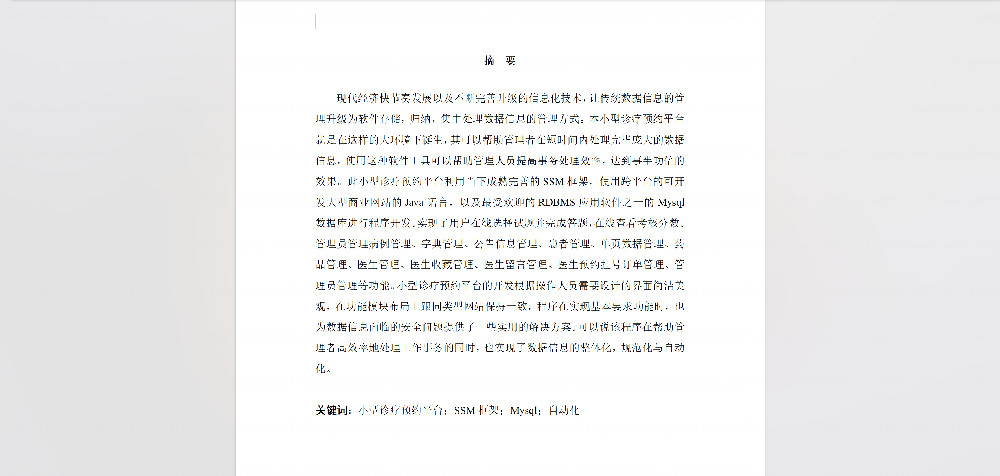
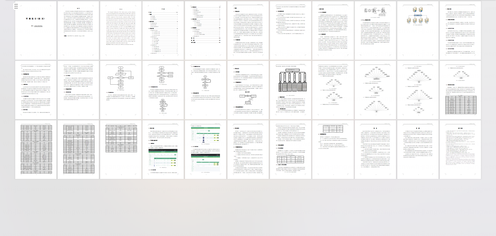

基于Springboot的小型诊疗预约平台（程序+论文）
=

### 完整代码获取地址：从戎源码网 ([https://armycodes.com/](https://armycodes.com/))
### 作者微信：19941326836  QQ：952045282 
### 承接计算机毕业设计、Java毕业设计、Python毕业设计、深度学习、机器学习
### 选题+开题报告+任务书+程序定制+安装调试+论文+答辩ppt 一条龙服务
### 所有选题地址https://github.com/nature924/allProject

一、项目介绍
---

基于SpringBoot框架的小型诊疗预约平台，系统角色为管理员、医生和患者，主要功能如下

管理员：
基本操作：登录、修改密码、获取个人信息、修改个人信息
公告管理：获取公告列表、发布公告、查看公告、删除公告
医生管理：筛选医生、获取医生列表、查看医生详情、新增医生、删除医生、修改医生信息
患者管理：筛选患者、获取患者列表、查看患者详情、新增患者、删除患者、修改患者信息
医生预约订单管理：获取订单列表、筛选订单、查看订单详情、处理退款、标记完成
病历管理：获取病历列表、筛选病历、查看病历详情、新增病历、删除病历、修改病历、变更缴费状态
医生留言管理：获取留言列表、筛选留言、查看留言详情、删除留言
医生收藏管理：获取收藏列表、筛选收藏、查看收藏详情、删除收藏
药品管理：筛选药品、获取药品列表、查看药品详情、新增药品、删除药品、修改药品
单页搜索管理：获取配置列表、筛选、查看详情、新增、删除、修改
系统用户管理：筛选用户信息、查看用户信息详情、删除用户信息、新增用户、重置密码
轮播图与系统配置：获取配置列表、查看详情、修改配置、删除配置

医生：
基本操作：登录、修改密码、获取个人信息、修改个人信息
医生预约订单管理：获取分配给自己的订单、筛选订单、查看订单详情、确认接诊/完成、处理退款
病历管理：获取病历列表、新增病历、填写/修改诊断、查看病历详情、删除病历
医生留言管理：获取留言列表、筛选留言、查看留言详情、回复/删除自己的留言
公告管理：获取公告列表、查看公告详情
药品信息：查看药品列表、筛选、查看详情

患者：
基本操作：登录/注册、修改密码、获取个人信息、修改个人信息
医生预约订单管理：筛选医生并发起预约、获取预约列表、查看预约详情
病历管理：查看个人病历、在线缴费、查看缴费状态
医生留言管理：向医生留言、查看回复、删除自己的留言
医生收藏管理：收藏/取消收藏医生、获取收藏列表、查看收藏详情
医生信息：筛选医生、查看医生详情
公告管理：获取公告列表、查看公告详情
首页单页搜索：使用首页搜索入口查询医生/内容
药品信息：查看药品列表、筛选、查看详情

二、项目技术
---
- 编程语言：Java
- 数据库：MySQL
- 项目架构：B/S架构
- 前端技术：JSP
- 后端技术：Spring、SpringMVC、MyBatis

三、运行环境
---
- 操作系统：Windows、macOS都可以
- JDK版本：JDK1.8以上都可以
- 开发工具：IDEA、Ecplise、Myecplise都可以
- 数据库: MySQL5.7以上都可以
- Tomcat：任意版本都可以
- Maven：任意版本都可以

四、运行截图
---
### 论文截图：

### 程序截图：

